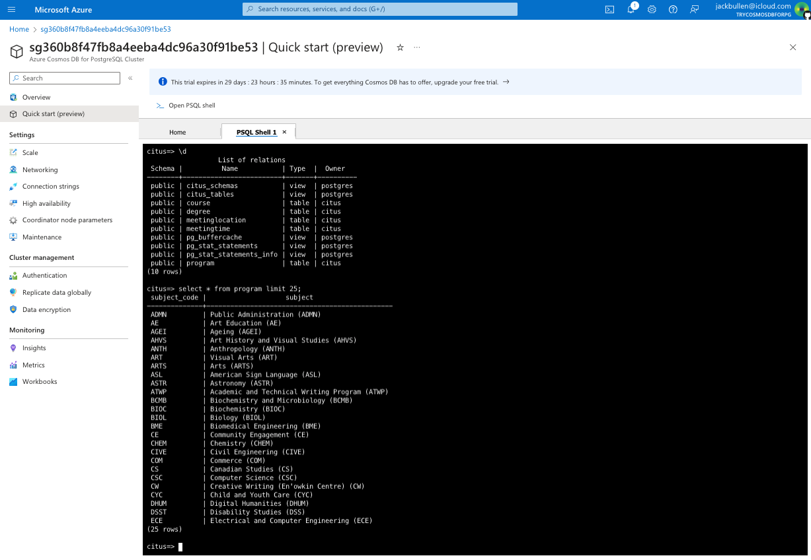

# Migrating data in psql stored in Django ORM tables to CSV then back into psql in normal tables in CosmosDB for PostgreSQL API

## Introduction
This document describes the process of migrating data from a PostgreSQL database in Django ORM to a CosmosDB for PostgreSQL API database. The data is first exported to CSV files and then imported into the CosmosDB database.

## Data out of Django ORM tables

Psql tables can be exported to Csv files using the `COPY` command. The `COPY` command is used to copy data between a file and a table. `COPY` requires the `SUPERUSER` privilege. It can be used to import or export data from a table to a file in various formats like CSV, DELIMITED, FIXED, etc. Here is an example

```sql
COPY table_name TO '/path/to/csv/file.csv' DELIMITER ',' CSV HEADER;
```

[The models that were migrated to make the tables are here](https://github.com/jackbullen/Course-API/blob/main/courses/models.py)

I have pasted them and removed some unrelevant bits for your reading pleasure, they include Program, Faculty, MeetingTime and MeetingLocation, Course, Section, Degree, and Specialization:

```python
from django.db import models
from django.template.defaultfilters import slugify

class Program(models.Model):
    subject_code = models.CharField(max_length=10, unique=True, primary_key=True)
    subject = models.CharField(max_length=100)

class MeetingTime(models.Model):
    slug = models.SlugField(max_length=200, unique=True, primary_key=True)
    term = models.CharField(max_length=6)
    start = models.CharField(max_length=6, null=True)
    end = models.CharField(max_length=6, null=True)
    monday = models.BooleanField(default=False)
    tuesday = models.BooleanField(default=False)
    wednesday = models.BooleanField(default=False)
    thursday = models.BooleanField(default=False)
    friday = models.BooleanField(default=False)
    saturday = models.BooleanField(default=False)
    sunday = models.BooleanField(default=False)
    
class MeetingLocation(models.Model):
    slug = models.SlugField(max_length=200, unique=True, primary_key=True)
    building = models.CharField(max_length=100, null=True)
    room = models.CharField(max_length=10, null=True)

class Course(models.Model):
    pid = models.CharField(max_length=30, unique=True, primary_key=True)
    slug = models.SlugField(max_length=200, unique=True)
    program = models.ForeignKey(Program, on_delete=models.CASCADE, related_name='courses')
    course_number = models.CharField(max_length=100) #370
    title = models.CharField(max_length=200) #Database Systems
    credit = models.CharField(max_length=100, null=True)
    hours = models.CharField(max_length=100, null=True)
    description = models.CharField(max_length=15000, null=True)
    notes = models.CharField(max_length=10000, null=True)
    link = models.CharField(max_length=200, null=True)
    
class Degree(models.Model):
    code = models.CharField(max_length=100, unique=True, primary_key=True)
    cred = models.CharField(max_length=100)
    program = models.ForeignKey(Program, on_delete=models.CASCADE, related_name='degrees', null=True) 
    description = models.CharField(max_length=10000, null=True)
    link = models.CharField(max_length=200, null=True)
    requirements = models.CharField(max_length=50000, null=True)
    notes = models.CharField(max_length=10000, null=True)
```

Looking in the database we can see the tables that were created from these models:

```sql
course_api=# \dt
               List of relations
 Schema |                Name                | Type  |       Owner       
--------+------------------------------------+-------+-------------------
 public | auth_group                         | table | psql_jack_supuser
 public | auth_group_permissions             | table | psql_jack_supuser
 public | auth_permission                    | table | psql_jack_supuser
 public | auth_user                          | table | psql_jack_supuser
 public | auth_user_groups                   | table | psql_jack_supuser
 public | auth_user_user_permissions         | table | psql_jack_supuser
 public | courses_course                     | table | psql_jack_supuser
 public | courses_coursesectionlink          | table | psql_jack_supuser
 public | courses_coursesectionlink_sections | table | psql_jack_supuser
 public | courses_degree                     | table | psql_jack_supuser
 public | courses_meetinglocation            | table | psql_jack_supuser
 public | courses_meetingtime                | table | psql_jack_supuser
 public | courses_program                    | table | psql_jack_supuser
 public | courses_section                    | table | psql_jack_supuser
 public | courses_specialization             | table | psql_jack_supuser
 public | django_admin_log                   | table | psql_jack_supuser
 public | django_content_type                | table | psql_jack_supuser
 public | django_migrations                  | table | psql_jack_supuser
 public | django_session                     | table | psql_jack_supuser
(19 rows)
```

The tables that I am interested in extracting are `courses_course`, `courses_degree`, `courses_meetinglocation`, `courses_meetingtime`, `courses_program`, and `courses_section`. The first courses refers to the Django app name and the second is the model name.

I will export the data from these tables to CSV files using the `COPY` command. The command will be run in the `psql` shell. The command will be run for each table and the data will be exported to a CSV file. The CSV files will be stored in the `/tmp` directory.

```sql
COPY courses_course TO '/tmp/courses_course.csv' DELIMITER ',' CSV HEADER;
COPY courses_degree TO '/tmp/courses_degree.csv' DELIMITER ',' CSV HEADER;
COPY courses_meetinglocation TO '/tmp/courses_meetinglocation.csv' DELIMITER ',' CSV HEADER;
COPY courses_meetingtime TO '/tmp/courses_meetingtime.csv' DELIMITER ',' CSV HEADER;
COPY courses_program TO '/tmp/courses_program.csv' DELIMITER ',' CSV HEADER;
```

The CSV files will be stored in the `/tmp` directory.

## Before going to Azure... first we will get them back into a local psql

I will create new tables in the database to store the data from the CSV files. The tables will have the same structure as the original tables. The data will be imported from the CSV files into the new tables.

```sql
CREATE TABLE course (
    pid VARCHAR(30) PRIMARY KEY,
    slug VARCHAR(200) UNIQUE,
    program_id VARCHAR(10),
    course_number VARCHAR(100),
    title VARCHAR(200),
    credit VARCHAR(100),
    hours VARCHAR(100),
    description VARCHAR(15000),
    notes VARCHAR(10000),
    link VARCHAR(200)
);

CREATE TABLE degree (
    code VARCHAR(100) PRIMARY KEY,
    cred VARCHAR(100),
    program_id VARCHAR(10),
    description VARCHAR(10000),
    link VARCHAR(200),
    requirements VARCHAR(50000),
    notes VARCHAR(10000)
);

CREATE TABLE meetinglocation (
    slug VARCHAR(200) PRIMARY KEY,
    building VARCHAR(100),
    room VARCHAR(10)
);

CREATE TABLE meetingtime (
    slug VARCHAR(200) PRIMARY KEY,
    term VARCHAR(6),
    start_time VARCHAR(6),
    end_time VARCHAR(6),
    monday BOOLEAN,
    tuesday BOOLEAN,
    wednesday BOOLEAN,
    thursday BOOLEAN,
    friday BOOLEAN,
    saturday BOOLEAN,
    sunday BOOLEAN
);

CREATE TABLE program (
    subject_code VARCHAR(10) PRIMARY KEY,
    subject VARCHAR(100)
);
```

**Note:** There is one small deviation in the schema. That is the meetingtime table uses the keyword `end` which is a reserved keyword in psql. I have changed this to `end_time`, and same for `start` to `start_time` to be consistent. This will need to be accounted for in the CSV files prior to importing.

This has been stored in `p.sql`, so naturally we can run this in the `psql` shell:

```bash
psql uni < p.sql
```

Now that the tables have been created, I will import the data from the CSV files into the new tables. The data will be imported using the `COPY` command.

```sql
COPY course FROM '/tmp/courses_course.csv' DELIMITER ',' CSV HEADER;
COPY degree FROM '/tmp/courses_degree.csv' DELIMITER ',' CSV HEADER;
COPY meetinglocation FROM '/tmp/courses_meetinglocation.csv' DELIMITER ',' CSV HEADER;
COPY meetingtime FROM '/tmp/courses_meetingtime.csv' DELIMITER ',' CSV HEADER;
COPY program FROM '/tmp/courses_program.csv' DELIMITER ',' CSV HEADER;
```

For some reason the csv file had PROGRAM_ID at the back, so I had to use this command for course table:
    
```sql
uni=# COPY course(pid, slug, course_number, title, credit, hours, description, notes, link, program_id) 
uni-# FROM '/tmp/courses_course.csv' 
uni-# DELIMITER ',' 
uni-# CSV HEADER;
COPY 3547
```

Similar thing for degrees (code,cred,description,link,requirements,notes,program_id).

## Now we will migrate the data to Azure

I will create a new database in Azure CosmosDB for PostgreSQL API using the [aka.ms/tryCosmosDB](aka.ms/tryCosmosDB) link. 

Now that I have the database created I will write a simple script in Python following this [tutorial on learn.microsoft](https://learn.microsoft.com/en-us/azure/cosmos-db/postgresql/quickstart-app-stacks-python)

```python
import psycopg2
from psycopg2 import pool

# NOTE: fill in these variables for your own cluster
host = "c-<cluster>.<uniqueID>.postgres.cosmos.azure.com"
dbname = "citus"
user = "citus"
password = "<password>"
sslmode = "require"

# Build a connection string from the variables
conn_string = "host={0} user={1} dbname={2} password={3} sslmode={4}".format(host, user, dbname, password, sslmode)

postgreSQL_pool = psycopg2.pool.SimpleConnectionPool(1, 20,conn_string)
if (postgreSQL_pool):
    print("Connection pool created successfully")

# Use getconn() to get a connection from the connection pool
conn = postgreSQL_pool.getconn()

cursor = conn.cursor()

# Create the tables
cursor.execute("CREATE TABLE course (pid VARCHAR(30) PRIMARY KEY, slug VARCHAR(200) UNIQUE, program_id VARCHAR(10), course_number VARCHAR(100), title VARCHAR(200), credit VARCHAR(100), hours VARCHAR(100), description VARCHAR(15000), notes VARCHAR(10000), link VARCHAR(200));")
cursor.execute("CREATE TABLE degree (code VARCHAR(100) PRIMARY KEY, cred VARCHAR(100), program_id VARCHAR(10), description VARCHAR(10000), link VARCHAR(200), requirements VARCHAR(50000), notes VARCHAR(10000));")
cursor.execute("CREATE TABLE meetinglocation (slug VARCHAR(200) PRIMARY KEY, building VARCHAR(100), room VARCHAR(10));")
cursor.execute("CREATE TABLE meetingtime (slug VARCHAR(200) PRIMARY KEY, term VARCHAR(6), start_time VARCHAR(6), end_time VARCHAR(6), monday BOOLEAN, tuesday BOOLEAN, wednesday BOOLEAN, thursday BOOLEAN, friday BOOLEAN, saturday BOOLEAN, sunday BOOLEAN);")
cursor.execute("CREATE TABLE program (subject_code VARCHAR(10) PRIMARY KEY, subject VARCHAR(100));")

# Import the data
with open('/tmp/courses_course.csv', 'r') as f:
    next(f) # skip header
    cursor.copy_from(f, 'course', sep=',')
    print("copying courses completed")

with open('/tmp/courses_degree.csv', 'r') as f:
    next(f)
    cursor.copy_from(f, 'degree', sep=',')
    print("copying degrees completed")

with open('/tmp/courses_meetinglocation.csv', 'r') as f:
    next(f)
    cursor.copy_from(f, 'meetinglocation', sep=',')
    print("copying meetinglocations completed")

with open('/tmp/courses_meetingtime.csv', 'r') as f:
    next(f)
    cursor.copy_from(f, 'meetingtime', sep=',')
    print("copying meetingtimes completed")

with open('/tmp/courses_program.csv', 'r') as f:
    next(f)
    cursor.copy_from(f, 'program', sep=',')
    print("copying programs completed")

# Clean up
conn.commit()
cursor.close()
conn.close()
```

Getting this error

```bash
cosmos.py", line 36, in <module>
    cursor.copy_from(f, 'course', sep=',')
psycopg2.errors.BadCopyFileFormat: extra data after last expected column
CONTEXT:  COPY course, line 1: "ByS23Pp7E,acan225,225,Introduction to the Arts of Canada,3.0,3-0-0,"<p>An interdisciplinary examinat..."
```

Issue is with psycopg2 copy_from function. If a field has commas in it, cursor.copy_from will treat all as plaintext, even with quotations. So instead use cursor.copy_expert. Found this [here on stackoverflow](https://stackoverflow.com/questions/30050097/copy-data-from-csv-to-postgresql-using-python)

# Conclusion

This was not so bad. Took around 1.5 hour but would've been less time if I knew what was causing the csv import issue for degrees and courses and psycopg2.copy_from(). Next step will be connecting this app to cloud database and then using the data.

